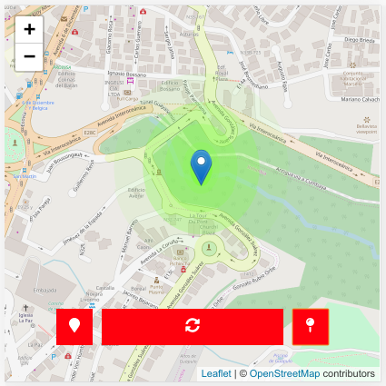

# Covid 19 Community Tracker
Check if you are near of suspected cases of covid-19. No sensible data is revealed.

<p align="center">
    
</p>

## Features

### User
- Login required.
- Suggest location of vulnerable people.
- Self-report about it health.
- Subscription to volunteers list.
- Food stores queue. 
- Check if they are near of this points possible covid focus.
- No sensible data is revealed.

### Admin
- Admin functions
  - Add possible covid focus.
  - Add vulnerable people.
  - Add food stores.
- Dashboard that show data:
  - suspected cases.
  - suggestions of vulnerable people.
  - subscriptions 
    - request food at home.
    - volunteer.
    - vulnerable people.

- Layers
  - Heatmap layer.
  - Markers layer.

## [DEMO: Click here!](https://community-tracker-covid-19.firebaseapp.com/)

## Technologies
- Typescript
- SCSS
- Prettier
- Angular
- Firebase
- Bootstrap
- Leaflet
- fingerprintjs2
- uuid
- geofire

## Setup

Now all required files has its template for more easy setup

Setup firebase:
```
firebase init
```

**Frontend**

Setup environment in `src/environments/environment.ts`. Check the template for reference:

``` javascript
export const environment = {
  production: true,
  firebase: {
    apiKey: '',
    authDomain: '',
    databaseURL: '',
    projectId: '',
    storageBucket: '',
    messagingSenderId: '',
    appId: ''
  },
  namespace: 'sdjskaldjsakldjsakdldsajlkdjsalk', // valid GUID
  api: 'https://mycloudfunctionsapi.com',
  countryBounds: {
    point1: { lat: 2.37928, lng: -92.69996 },
    point2: { lat: -5.41915, lng: -75.10254 }
  },
  countryCenter: {
    center: { lat: -1.36218, lng: -78.37646 }
  }
};

```

**Cloud functions**

Setup environment in `functions/env.json`.

[Setup Firebase AdminSDK](https://firebase.google.com/docs/admin/setup) file in `functions/env.json`:`serviceAccount`.

Check the template for reference:
```JSON
{
  "serviceAccount": {
    "type": "",
    "project_id": "",
    "private_key_id": "",
    "private_key": "",
    "client_email": "",
    "client_id": "",
    "auth_uri": "",
    "token_uri": "",
    "auth_provider_x509_cert_url": "",
    "client_x509_cert_url": ""
  },
  "firebase": {
    "databaseURL": "",
    "appURL": ""
  }
}

```

**Proximity checker**

You can customize the proximity checker algorithm in `functions/src/index.ts`

- By default it's checking 10km around
- If more cases are found so proximity is more
  ```
  - 0 -> far
  - [1, 4] -> warning
  - [5, ...] -> near
  ```

**Database rules**

  Remember block any operation: 'read', 'update', 'delete', 'write'

## Development

1. Install dependencies

```console
npm install
```
2. Star development server

```console
npm run start
```
3. Start to develop

Navigate to [localhost:4200](http://localhost:4200).

## Deploy
```console
npm run deploy
```

## Acknowledgment
Thanks for people to contribute with it's ideas/opinions.

## Licence
Luis Reinoso [MIT LICENCE](LICENCE)


